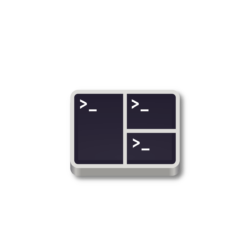

<a href="https://github.com/nvm-sh/nvm"></a>
<a href="https://code.visualstudio.com"></a>
<a href="https://www.terraform.io/"></a>
<a href="https://slack.com/"></a>
<a href="https://github.com/gnunn1/tilix"></a>

# Aprovicionamiento de equipo con Ubuntu 22.04 LTS utilizando Ansible

# Contenido

-   [Objetivo](#objetivo)
    -   [Instalar Ansible](#instalar-ansible)
    -   [Roles externos](#roles-externos)
-   [Anexos](#anexos)
    -   [Roles externos](#roles-externos-1)

## Objetivo

El objetivo de este proyecto es automatizar la instalación de software y configuraciones en un equipo con Ubuntu 22.04 LTS, para ello se ha utilizado Ansible.

Algunos de los roles están escritos dentro del mismo proyecto y otros son instalados desde **_galaxy.ansible_**, en el archivo **_requirements.yml_** se encuentran los roles que se instalarán.

## Uso

1. Instalar Ansible

```sh
sudo apt install ansible
```

2. Clonar el repositorio

```sh
git clone https://github.com/jeastman19/ansible-ubuntu-22.04
```

3. Instalar roles

```sh
ansible-galaxy install -r requirements.yml
```

4. Ejecutar playbook

```sh
./install.sh
```

# Anexos

## Roles externos

Existen en [Ansible Galaxy][ansible galaxy] una gran cantidad de roles que nos permiten automatizar la instalación de software y configuraciones, en este proyecto hemos utilizado los siguientes:

-   [Git](https://galaxy.ansible.com/geerlingguy/git)
-   [Oh my zsh](https://galaxy.ansible.com/gantsign/oh-my-zsh)
-   [Docker](https://galaxy.ansible.com/geerlingguy/docker)
-   [Kubectl](https://galaxy.ansible.com/andrewrothstein/kubectl)
-   [Docker Compose](https://galaxy.ansible.com/andrewrothstein/docker-compose)
-   [Minikube](https://galaxy.ansible.com/gantsign/minikube)
-   [Kubectl](https://galaxy.ansible.com/andrewrothstein/kubectl)
-   [Oh my zsh](https://galaxy.ansible.com/gantsign/oh-my-zsh)
-   [Visual Studio Code](https://galaxy.ansible.com/gantsign/visual-studio-code)
-   [Terraform](https://galaxy.ansible.com/andrewrothstein/terraform)
-   [Postman](https://github.com/gantsign/ansible-role-postman)
-   [Tilix[(https://galaxy.ansible.com/darkwizard242/tilix)]]

# TODO

-   Probar: [ansible-galaxy install jonaspammer.bootstrap](https://galaxy.ansible.com/jonaspammer/bootstrap)

[ansible galaxy]: https://galaxy.ansible.com/
